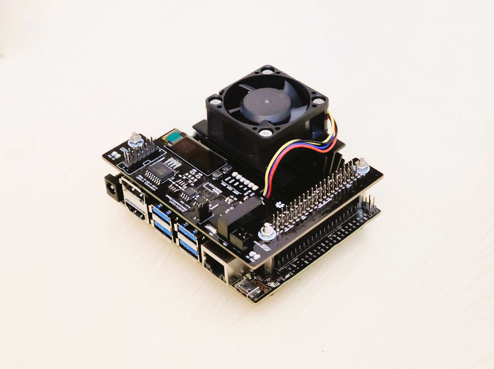

# Jetson Nano Communication Shield

## Overview
A robust, fast, and reliable interface between high-level and low-level controllers is crucial in robotics and automation solutions. While industrial applications commonly rely on networks like CAN Bus and RS485, simpler networks like I2C or SPI are sometimes needed for less complex systems or shorter distances.

For this matter, the Jetson Nano Communication Shield is here to help! This board is designed by the students at LENNA Robotics Research Laboratory at Iran University of Science and Technology. 
Initially designed as a modular shield for communication between Jetson Nano and a low-level MCU board in mobile robotics applications, it has now evolved into a versatile product for automation and robotics solutions.

## Features
This design includes isolated serial interfaces for board-to-board communication, particularly in laboratory and industrial use cases. It features a simple OLED display, secures power supply requirements, and uses digital isolators for each communication interface. 

The technical details are as follows:

1. **User Interface Module:**

    A 0.91" OLED Display is provided for monitoring the state of the Jetson Nano through the I2C bus 2. Additionally, some I/O pins are used for LED blinking and push-button inputs.

 

2. **Power Requirements and Isolation:**

    In this design, the 3.3V of the Jetson Nano is left unconnected. Instead, an LDO voltage regulator (LD3985M33R) generates the required 3.3V power for onboard Integrated Circuits and components. This solution prevents excessive load on the Jetson Nano 3.3V power.

    Furthermore, a DC/DC converter (B0505LS) regulates an isolated 5V power for serial interfaces. It also powers another voltage regulator (LF33) to provide the isolated 3.3V. The user can then select between these two power sources for the signals of external nodes using the provided Jumper.

    Another notable feature of this design is the inclusion of a connector that allows the Jetson Nano to be powered through the GPIOs. This connector serves as a 5V input power source capable of powering the entire board independently. It's important to note that there is a dual-power input mechanism that allows the selection between two power sources: the onboard connector and the Jetson Nano's power connectors. This is achieved using an Op-Amp (L358) and a PNP Transistor. By employing this setup, the board gains flexibility in terms of power supply, allowing it to adapt to specific requirements as needed.

 

3. **Communication Networks:**

    As mentioned earlier, digital isolators are employed for each interface. The UART communication protocol utilizes a dual-channel digital isolator (ADuM3201). For the I2C protocol, a dual-I2C isolator (ADuM1250) is used, and for SPI, a fast digital isolator (ADuM1401).

    To facilitate simple digital I/O interaction between the SBC and other devices, a high-speed optocoupler is incorporated to isolate the PWM signals of the Jetson Nano. This optocoupler can be utilized for basic parallel communication as well as PWM control. Its inclusion ensures effective and reliable signal isolation, enabling seamless communication between the Jetson Nano and external devices.

 

### Specification
| Items | Description |
|  ---  |    -----    |
| Input Power Sources | **5V Power Source**   ▪️ &ensp; Jetson Nano Input Power Source │ *RECOMMENDED* │   ▪️ &ensp; Onboard Power Port &nbsp;( [JST XH Connector 2-PIN Plug](https://www.jst.com/products/crimp-style-connectors-wire-to-board-type/xh-connector/) ) |
|  User Interface Module | 0.91" OLED Display   x 1 &ensp; LED Blink   x 2 &ensp; Push Buttons |
|  Communication Ports  | UART   SPI   I2C |
|  Digital I/O  | x 2 &ensp; PWM |

  

> **NOTE**  
> The presented design has limitations due to the unavailability of certain components in the market and specific application constraints. Firstly, the isolated UART communication does not include the RTS and CTS pins. To isolate these signals, the quad-channel digital isolator ADuM1402 can be used as a suitable component. Furthermore, for SPI communication, the fast isolator can only operate when the Jetson Nano functions as the Master. To address this issue, it is recommended to integrate components like the multi-slave digital isolator ADuM4154. Please be aware that the mentioned part numbers are suggestions to assist in the development of your design. You are welcome to use other components suitable for your specific application. Datasheets and design documents for each device can be found in this repository.

> **WARNING**  
> It is important to understand that the onboard input power source cannot be used as an output power source to supply power to other devices. This is because it is NOT connected to the Jetson Nano's 5V power. Its sole purpose is to power the Jetson Nano and the shield through the GPIOs. Additionally, it is crucial to note that the input power connector does not include any additional voltage regulation circuits. Therefore, it is critical to provide a clean and steady 5V voltage input using an external power circuit. This ensures safety, prevents any potential damage to the board, and promotes efficient performance. While this input power source is provided for user convenience and several integrated applications such as mobile robotics, it is strongly recommended to power up the board using the designated NVIDIA Jetson Nano power options. This approach is considered safer and more efficient, guaranteeing optimal performance and preventing any potential issues.

## Acknowledgment
The "RS485 CAN Bus for Jetson Nano", designed by Waveshare Electronics, served as a valuable source of inspiration for the development of our communication shield. Although our design offers completely different serial interfaces, we incorporated some of their design principles and concepts into our product. Hence, we extend our sincere appreciation to Waveshare Electronics. Additionally, it is worth noting that our communication shield is fully compatible with the "RS485 CAN Bus for Jetson Nano". By employing separate communication interfaces, both devices can function harmoniously alongside one another.

## APPENDIX
### Folder Structure
The project folder structure is organized to encompass all essential components while promoting efficiency and ease of access. Below is the folder structure for this project:

    .  
    ├── Resources  
    │   ├── Datasheets  
    │   ├── Reading Materials  
    │   └── Comparable Products  
    ├── Design  
    │   ├── Conceptual Design  
    │   ├── System Level Design  
    │   ├── Detailed Design  
    │   │   ├── Electronics  
    │   │   └── Source Code  
    │   └── Design Reviews 
    ├── Documentaion  
    │   ├── User Manuals  
    │   └── Technical Notes  
    └── ...  

### Contributing
We greatly appreciate your contributions, which can take various forms such as raising issues, creating Pull Requests to improve or expand documentation, as well as resolving existing issues or adding new features.

